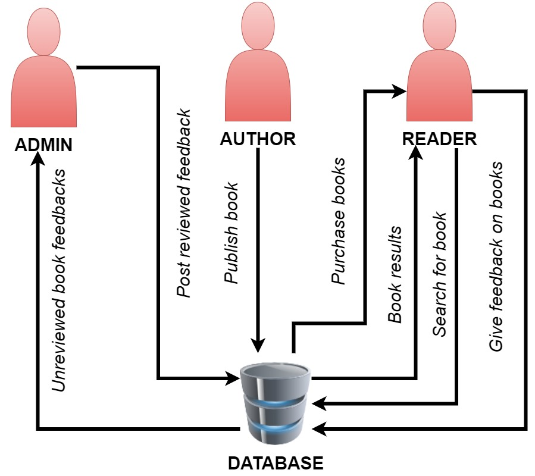

# INDEPENDENT BOOK PUBLISHING SYSTEM

## DESCRIPTION
This system is a pathway for self-publishing authors to make their books available to readers free of charge. This is accomplished by allowing authors to not only sell hardcopy versions of their books, but also PDF formats of them.

The system has three users, viz -
- Admin
- Author
- Reader

## TOOL AND TECHNOLOGIES
- Frontend
    - HTML
    - CSS
    - JavaScript
- Backend
    - PHP

## SYSTEM WORKFLOW
